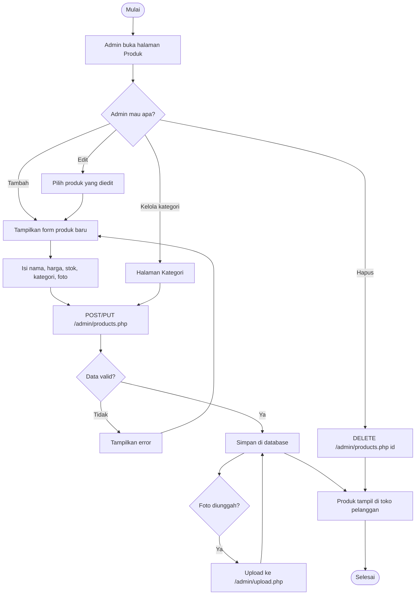

# Activity Diagram — Ungkepan SN

Diagram alur proses toko **Ungkepan SN** (React frontend `ungkepan-sn` + Laravel API `ungkepan-sn-api`).
Render dengan *Mermaid* (VS Code + ekstensi Mermaid, Obsidian, GitHub, atau mermaid.live).

---

## 1. Alur Belanja & Checkout (Pelanggan)

```mermaid
flowchart TD
    Start([Mulai]) --> Browse[Buka website]
    Browse --> ListProduk[Lihat daftar produk / kategori]
    ListProduk --> Detail{Lihat detail produk?}
    Detail -- Ya --> Info[Lihat harga, stok, review]
    Info --> Stock{Stok tersedia?}
    Stock -- Tidak --> ListProduk
    Stock -- Ya --> Add[Tambah ke keranjang]
    Add --> Lagi{Belanja lagi?}
    Lagi -- Ya --> ListProduk
    Lagi -- Tidak --> Checkout[Buka halaman Checkout]

    Checkout --> Form[Isi nama, no. WA, alamat]
    Form --> Map[Pilih lokasi di peta]
    Map --> Ship[Pilih metode pengiriman]
    Ship --> Calc{Hitung ongkir}
    Calc -- Lokal --> Jarak[Hitung jarak dari toko]
    Jarak --> Besar{Jarak > maksimal?}
    Besar -- Ya --> Blokir[Pengiriman lokal dinonaktifkan]
    Blokir --> Form
    Besar -- Tidak --> Gratis{Total >= minimal gratis ongkir?}
    Gratis -- Ya --> Cost0[Ongkir = 0]
    Gratis -- Tidak --> CostKm[Hitung ongkir per km]
    Calc -- Kurir/Ekspedisi --> CostEks[Ongkir = tarif tetap]
    Calc -- Ambil Langsung --> Cost0

    Cost0 --> Pay[Hitung Total = Subtotal + Ongkir]
    CostKm --> Pay
    CostEks --> Pay

    Pay --> Metode[Pilih pembayaran]
    Metode --> QRIS{QRIS?}
    QRIS -- Ya --> Scan[Scan QRIS]
    QRIS -- Tidak --> Manual[Transfer / E-Wallet / COD]
    Scan --> Submit[Tekan "Buat Pesanan"]
    Manual --> Submit

    Submit --> API[Kirim ke API: POST /orders.php]
    API --> Tx[Mulai transaksi database]
    Tx --> Lock[Kunci baris produk]
    Lock --> Cukup{Stok cukup untuk semua item?}
    Cukup -- Tidak --> Gagal[Rollback + tampil error stok tidak cukup]
    Gagal --> Checkout
    Cukup -- Ya --> Kurangi[Kurangi stok]
    Kurangi --> Simpan[Simpan pesanan + item, status = pending]
    Simpan --> Commit[Commit transaksi]
    Commit --> Res[Balas order_code ke frontend]

    Res --> Struk[Tampilkan halaman "Pesanan Berhasil" + struk]
    Struk --> WA{Kirim konfirmasi via WhatsApp?}
    WA -- Ya --> WaSend[Kirim struk + bukti bayar ke WA]
    WA -- Tidak --> Skip
    WaSend --> Lihat[Cek status via "Pesanan Saya"]
    Skip --> Lihat
    Lihat --> Done([Selesai])
```

---

## 2. Alur Admin — Login

```mermaid
flowchart TD
    Start([Mulai]) --> Open[Admin buka halaman login]
    Open --> Input[Masukkan username & password]
    Input --> Post[Kirim POST /admin/login.php]
    Post --> Cek{Username & password valid?}
    Cek -- Salah --> Err[Tampilkan "Username atau password salah"]
    Err --> Input
    Cek -- Benar --> Token[Simpan token di penyimpanan browser]
    Token --> AuthState[Setiap panggilan admin kirim header Authorization: Bearer token]
    AuthState --> Done([Masuk dashboard])
```

---

## 3. Alur Admin — Kelola Pesanan

```mermaid
flowchart TD
    Start([Mulai]) --> Lib[Admin buka halaman Pesanan]
    Lib --> Ambil[GET /admin/orders.php <- filter status]
    Ambil --> List[Lihat daftar pesanan + detail item]

    List --> Aksi{Admin mau apa?}
    Aksi -- Ubah status --> Step[PUT /admin/orders.php id + status]
    Step --> Valid{Status valid?}
    Valid -- Tidak --> Err[Tampilkan error status tidak valid]
    Err --> List
    Valid -- Ya --> Update[Update status di database]
    Update --> Stat{pending -> processed -> shipped -> completed}
    Stat --> Notif[Cek "Pesanan Saya" pelanggan menampilkan status terbaru]
    Notif --> List

    Aksi -- Hapus --> Hapus[DELETE /admin/orders.php id]
    Hapus --> Del[Pesanan dihapus dari database]
    Del --> List

    Aksi -- Tidak ada --> Done([Selesai])
    List --> Done
```

---

## 4. Alur Admin — Kelola Produk & Kategori

